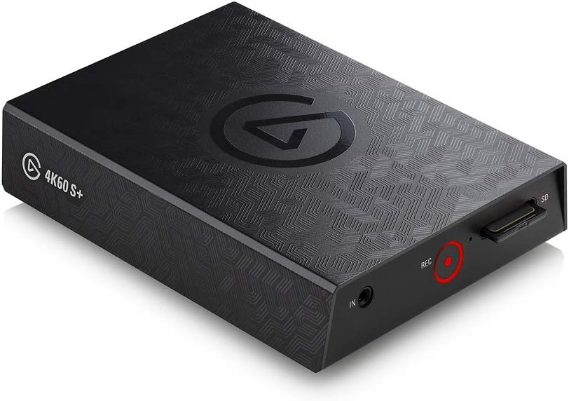
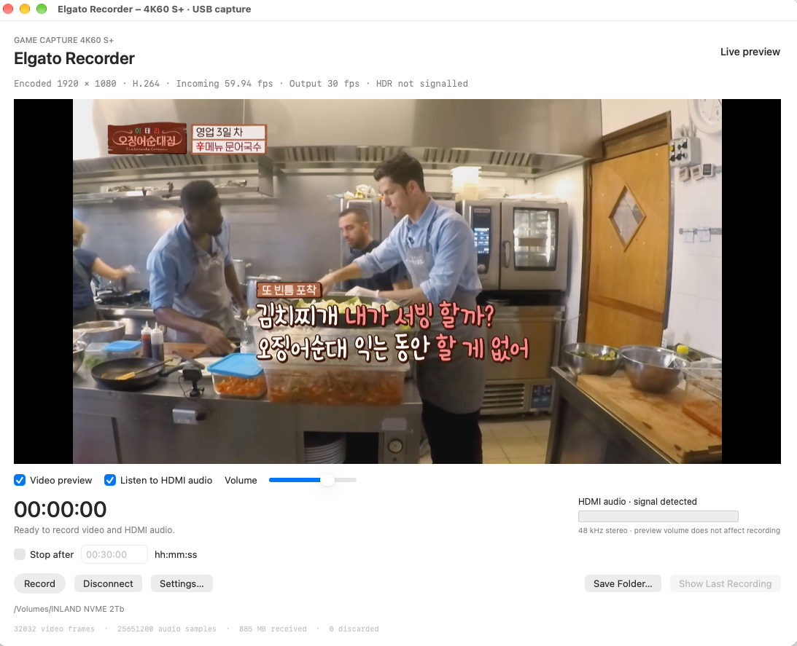

# Elgato 4K60 S+ Recorder

A native macOS app for recording HDMI video and stereo audio from the
**Elgato Game Capture 4K60 S+ (20GAP9901)** over USB.
Independent community software, not affiliated with Elgato or Corsair.

**[Download the latest release](https://github.com/Delitants/Elgato-4K60-S-Plus-Recorder/releases/latest)** · **Current: v0.6.10** · macOS 26+

## Install and record

1. Download **macOS-Apple-Silicon** for M-series Macs or **macOS-Intel** for
   Intel Macs, unzip it, and
   move **Elgato Recorder.app** to Applications.
2. Connect the device's power supply, its **PC/data USB port** to a USB 3 port,
   and your source to **HDMI IN**. Set source audio to **stereo PCM**.
3. Open the app, choose **Save Folder…**, and open **Settings…**. Match the
   device encoder resolution to your source: **1080p for 1080p**, **4K for 4K**.
4. Click **Record** (⌘R). Stop to finalize the file; **Show Last Recording**
   reveals it in Finder.

USB, recording, and NDI runtimes are bundled; no Homebrew or FFmpeg installation
is needed. Builds are ad-hoc signed, not notarized. If macOS blocks first launch,
verify the release checksums and approve the app in **System Settings → Privacy
& Security**.

## Features

| | Supported options |
|---|---|
| Capture | 1080p / 4K; H.264 or HEVC Main 10 |
| Video | Original device stream, H.264 / AVC, HEVC, ProRes 422, AV1 |
| Audio | PCM, AAC, ALAC, Opus, FLAC; 48 kHz stereo |
| Files | MOV, MP4, MKV, MPEG-TS; split by time or approximate size |
| Encoding | Hardware/software options, bitrate and quality controls, compression effort |
| Output | FPS caps, downscaling and sampling filters |
| Preview | Independent video/audio toggles, volume and stereo level meters |
| Recording | Editable stop timer, disk usage, automatic audio/video timing recovery with warnings |
| OBS | NDI video and audio output; install DistroAV in OBS |

The main window shows the app version, USB speed, measured device bitrate and
incoming/output FPS. **Stop after** can be changed while recording and always
counts from the recording's original start time.

## Important limits

- **4K60 S+ only.** Other Elgato models are unsupported. This app currently
  requires USB 3; USB 2 capture is not enabled.
- HDMI resolution is selected manually. **Incoming FPS** measures the device
  stream; a source-content cap does not change the physical HDMI signal.
  FPS conversion does not synthesize intermediate frames.
- Use unencrypted HDMI and **stereo PCM**. HDCP-protected video and Dolby/DTS
  input are unsupported.
- **HDR10 preservation** requires HEVC capture and Original device stream.
  Actual HDR HDMI capture remains unverified; HDR transcoding and tone mapping
  are unsupported.
- AV1 is software-only and can be too slow for real-time capture. Hardware CQ
  requires Apple Silicon. Hardware H.264 requires B-frames disabled.
- Recoverable timing errors and recording queue stalls warn and continue. Queue
  recovery may skip a short section to the next keyframe. Disk failures or a dead
  or persistently blocked encoder can still stop recording; saving a partial file
  is best effort.
- Apple Silicon was tested on an M1 Pro. Intel was tested through Rosetta,
  not on a physical Intel Mac. See [validation details](VALIDATION.md).

## Documentation and credits

- [Recording and settings guide](USAGE.md) — formats, quality, film cadence, HDR and NDI setup.
- [Build instructions](BUILD.md) · [Test results](VALIDATION.md) · [Release notes](RELEASE-NOTES.md).
- [Research sources and provenance](SOURCES.md) — USB work builds on
  [Saddytech/elgato4k60sp-linux](https://github.com/Saddytech/elgato4k60sp-linux)
  and [Elgato's public examples](https://github.com/elgatosf/capture-device-support).

The app is GPL-2.0; the media helper is GPL-3.0-or-later. The NDI runtime has
separate proprietary terms. See [LICENSE](LICENSE), [component notices](Licenses/THIRD-PARTY.txt)
and [NDI terms](Licenses/NDI-RUNTIME-TERMS.txt). NDI® is a registered trademark of
Vizrt NDI AB; this project is not sponsored or endorsed by NDI.

For MKV files shared over DLNA, use **Settings → Output → MKV network playback → Prefer seek index at front**. See [network playback](docs/NETWORK-PLAYBACK.md) for existing-file repair on Windows and compatibility limits.
