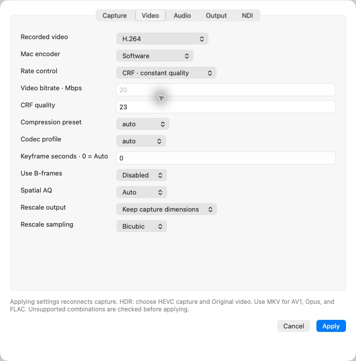

# Elgato Recorder for macOS

A native AppKit recorder for **Elgato Game Capture 4K60 S+ (20GAP9901)** over USB 3.
Independent community software; not affiliated with Elgato or Corsair. This is
experimental support for a device that Elgato does not officially support on macOS.

[Download ARM or Intel releases](https://github.com/Delitants/ElgatoRecorder-macOS/releases)



## Install

Requires **macOS 26 or later**. Choose **arm64** for Apple Silicon or **x86_64** for
Intel, extract the ZIP, and move **Elgato Recorder.app** to Applications.
The app includes its USB library, recording backend, and NDI runtime. Homebrew,
FFmpeg, and a separate NDI installation are not needed to run the recorder.

These builds are ad-hoc signed, not Apple notarized. macOS may require approval
in System Settings → Privacy & Security on first launch. Verify the release
checksums before approving a downloaded build.

ARM was tested on an M1 Pro. Intel code and bundled libraries were tested through
Rosetta on that Mac; a physical Intel Mac has not been tested. Hardware encoders
and performance depend on the Mac. See [validation and limitations](VALIDATION.md).

## Capture

1. Connect the Elgato power supply, its **PC/data USB port** to a USB 3 port, and
   the source to **HDMI IN**. Close other software using the device.
2. Open the app, choose **Save Folder…**, and select recording settings.
3. Click **Record** (⌘R). Stop, disconnect, or quit to finalize the recording.
4. **Show Last Recording** reveals the most recently finalized file or split part.

The HDMI source must send supported, unencrypted video and **stereo PCM audio**.
HDCP-protected video cannot be recorded. Dolby/DTS multichannel input is not
supported by this device; select stereo PCM on the source.

**Match the device encoder resolution to the HDMI source.** Use 1920×1080 for
1080p, and 3840×2160 only for a 4K source. This release requests encoder dimensions
manually; it does **not** detect the physical HDMI input resolution automatically.
The displayed **Encoded** resolution describes the incoming compressed stream,
not an independently measured HDMI input. Capture timing is currently nominal
60/59.94 fps; other source rates are not validated.

Video and audio preview toggles are independent of recording. Monitoring volume
only affects playback through the Mac. Audio uses a bounded, preallocated ring
buffer, with approximately 64 ms of startup buffering and recovery after a stall.
It cannot remove the capture hardware's inherent latency. Under sustained system
load, preview may skip or resynchronize rather than grow an unbounded delay.

**Stop after** takes `hh:mm:ss`. Its monotonic wall-clock timer begins when Record
is pressed, including time waiting for the first keyframe or a lost HDMI signal.
The media file can therefore be shorter than the timer interval.

## Formats and controls

| Area | Options |
|---|---|
| Device encoding | H.264 8-bit; HEVC Main 10; 1080p or 4K |
| Recorded video | Original device stream, H.264, HEVC, ProRes 422, AV1 |
| Containers | MOV, MP4, MKV, MPEG-TS |
| Audio | PCM, AAC, ALAC, Opus, FLAC; 48 kHz stereo |
| Processing | Automatic, required hardware, software decoding/encoding where supported |
| Rate control | ABR; CBR for supported H.264/HEVC paths; software CRF |
| Compression | Software presets, AV1 effort, ProRes profiles, Opus/FLAC effort |
| Advanced video | Codec profiles, B-frames, keyframe interval (0 = Auto), spatial AQ |
| Downscale | Keep encoded dimensions, 1080p, 720p; Disabled/Bilinear/Area/Bicubic/Lanczos |
| Splitting | Time or approximate size, at the next source keyframe |
| OBS output | NDI video and stereo audio; original, 1080p, or 720p SDR |

Use **MKV** for AV1, Opus, or FLAC. MP4 requires H.264/HEVC with AAC; MPEG-TS
requires H.264/HEVC with AAC. Unsupported combinations are rejected before capture
is reconfigured. Original video copies the device's compressed stream and does
not expose Mac-encoder controls. Bitrate controls are targets, not exact file-size
guarantees. CRF trades variable bitrate for a quality target.

AV1 is software-only in this release and may not keep up with real-time 4K60 on
your CPU. Intel AV1 uses a portable C build and has reduced performance. Required
hardware modes fail clearly when unavailable. Software ProRes is unavailable.

Splits can exceed their time/size target by a source GOP plus encoder/container
buffering. Each finalized part starts at a video keyframe; PCM is divided at the
corresponding audio sample. Lossy audio encoders may introduce priming/padding at
individual segment boundaries. If the recording backend cannot keep up, recording
stops with an error instead of silently dropping recording frames. Keep any
reported partial file; an error does not guarantee the last file was finalized.

## HDR

Use **HEVC** capture and **Original device stream** to preserve HDR10 metadata.
A 10-bit stream is not by itself evidence of HDR. The status reports the signaled
transfer function. Synthetic PQ/BT.2020 metadata preservation was tested; actual
HDR HDMI capture and display appearance remain unverified. HDR transcoding,
tone mapping, HDR NDI output, Dolby Vision, and HLG capture are not supported.

## NDI output to OBS

Enable **Settings → NDI**, set a stream name, and select the output size. In OBS,
install [DistroAV](https://github.com/DistroAV/DistroAV), add an **NDI Source**, and
select the recorder's stream. OBS/DistroAV may require its own NDI runtime setup;
the recorder's bundled runtime is private to the recorder. Video and stereo audio
output continue independently of local preview toggles and recording.

[About NDI](https://ndi.video) · NDI® is a registered trademark of Vizrt NDI AB.
The bundled proprietary runtime has [separate terms](Licenses/NDI-RUNTIME-TERMS.txt).
This project is not sponsored or endorsed by NDI.

## Build and test

See [BUILD.md](BUILD.md) for ARM/Intel build commands and dependency versions.
The release provides a matching dependency source archive and build recipes.

```sh
bash test.sh
bash test-hdr.sh
MEDIA_HELPER='/path/to/Elgato Recorder.app/Contents/MacOS/MediaHelper' bash test-advanced.sh
NDI_HELPER='/path/to/Elgato Recorder.app/Contents/MacOS/NDISender' \
NDI_RUNTIME='/path/to/Elgato Recorder.app/Contents/Frameworks/libndi.dylib' bash test-ndi.sh
```

Media fixtures and test recordings use temporary directories and are removed on
exit. Test tools require FFmpeg/ffprobe and Xcode command-line tools.

## Licenses

The native application and adapted USB initialization are GPL-2.0; see [LICENSE](LICENSE).
The standalone media helper is GPL-3.0-or-later and uses FFmpeg and its separately
licensed codec libraries. The standalone NDI sender source and headers are MIT;
the NDI runtime is proprietary. These are separate executable components, using
bounded PCM/video IPC; FFmpeg is not linked to NDI. See [component notices](Licenses/THIRD-PARTY.txt)
and the licenses shipped inside the app. GPL/LGPL source, rebuild, and library
replacement rights apply to their respective components; NDI terms do not apply
to those open-source components.

USB interoperability work builds on [Saddytech/elgato4k60sp-linux](https://github.com/Saddytech/elgato4k60sp-linux)
and [Elgato's public device-support examples](https://github.com/elgatosf/capture-device-support).

Live release testing found that AV1 1080p60 with 4K input and NDI could not keep up
on the loaded M1 Pro. The app reports overload and retains the partial file.
See [validation results](VALIDATION.md) for the tested matrix and limitations.
